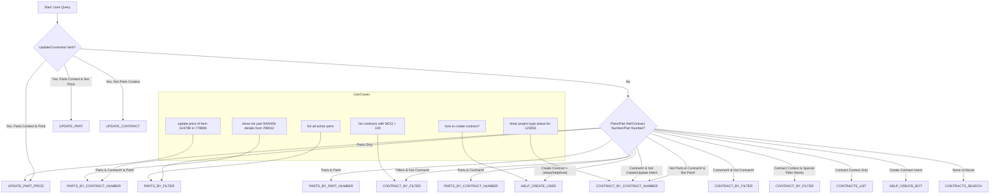

# Action Type Selection Logic (StandardJSONProcessor)

**Legend:**
- Each node represents a possible action type.
- Diamonds represent decision points in the logic.
- User cases (bottom) are mapped to the action type node they trigger.

**How to view:**
- Use a Mermaid live editor or compatible Markdown viewer to see the rendered diagram. 