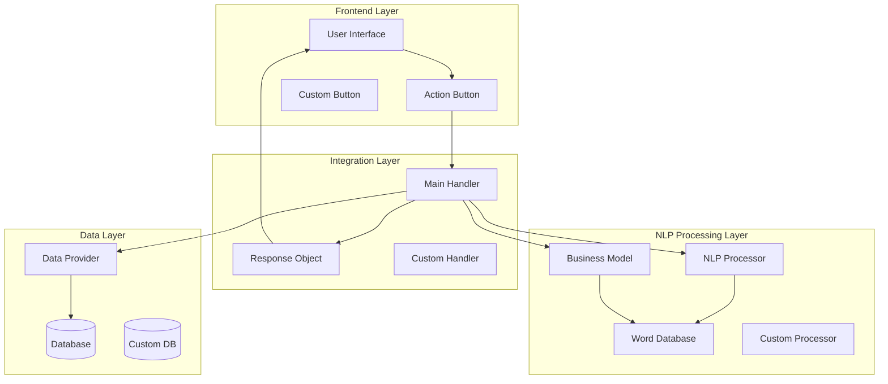
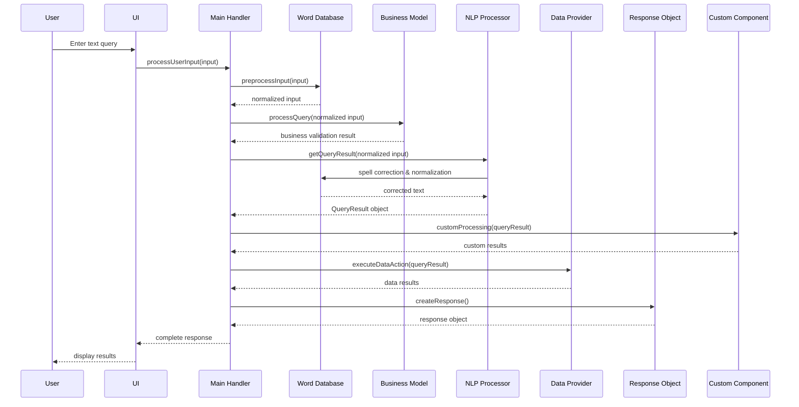
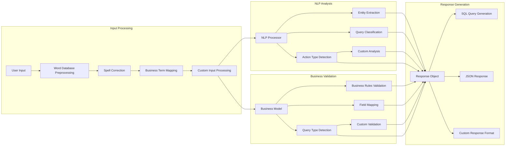
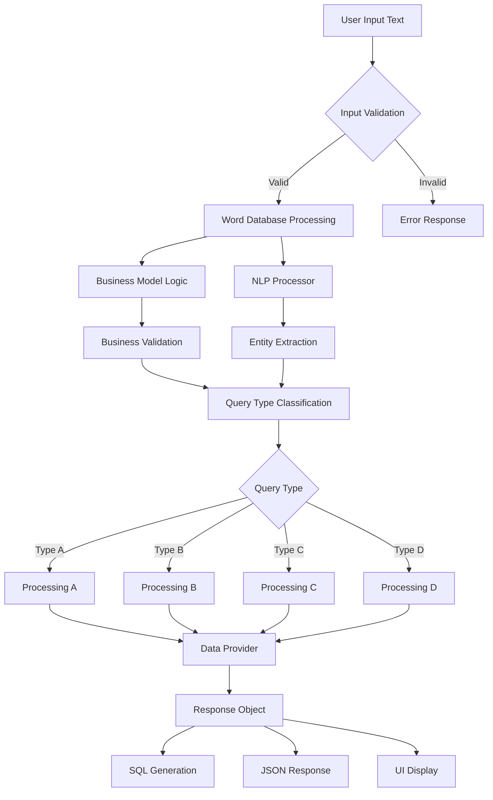

# NLP System Architecture Diagrams

## 1. System Architecture Overview

## 2. NLP Engine Processing Flow

## 3. Component Interaction Diagram

## 4. Data Flow Architecture

## Instructions for Word Document:

1. **Copy each diagram** by selecting the code block and copying it
2. **Paste into Word** - Word should automatically render the Mermaid diagrams
3. **If Word doesn't render Mermaid:**
   - Use online Mermaid editor: https://mermaid.live
   - Paste the code and export as PNG/SVG
   - Insert the image into Word

## Easy Class Name Replacement:

When you're ready to customize, just replace these generic terms:
- `Main Handler` → Your actual handler class name
- `NLP Processor` → Your NLP engine class name
- `Business Model` → Your business logic class name
- `Data Provider` → Your data access class name
- `Response Object` → Your response class name
- `Custom Component` → Your specific custom classes 